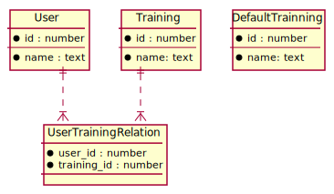

# erd


# パターン１
## 概要
ユーザー登録時にdefault_trainningをもとにtrainningを作成する

## 流れ
userが登録する
default_trainningの一覧を取得して、ユーザーに紐づける

## 処理の例
```
user = User.new
default_trainnings = default_trainning.find_all
default_trainnings.map do |dt|
  user.trainning(name: dt.name)
end

user.save
```

## 利点
依存関係がスッキリしている

## 欠点
後からdefault_trainningを追加しても既存のユーザーには反映されない

# パターン２
## 概要
trainningの取得時にdefault_trainningを取得して、trainningsと合わせて返す

## 流れ
userがtrainningの一覧を要求する
default_trainningとtrainningをユーザーに返す

## 処理の例
```
default_trainngins = default_trainning.find_all
user_trainngings = user.trainnings

trainnings = merge(default_trainngins, user_trainngings)
return trainnings
```

## 利点
default_trainningsの反映が自動的に反映される

## 欠点
default_trainningsの削除をすると、それまでに作成されたデータに不具合が発生しそう